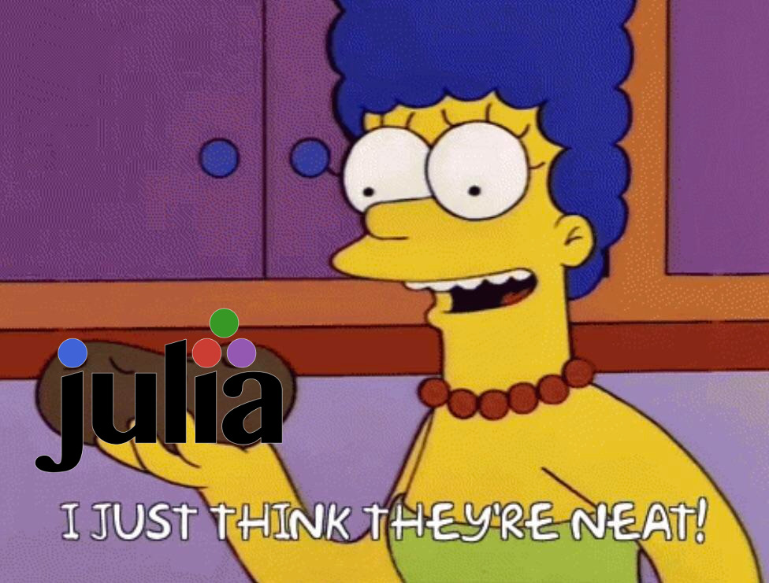

@def title = "About some responses to that \"Correctness in julia\" post"
@def tags = ["julia", "correctness", "interfaces", "formal_methods"]

# About some responses to that "Correctness in julia" post

\toc

## Full disclosure

I've been using julia for about 5 years now, since right around 0.5 transitioned to 0.6. I'm very active on Discourse and Slack, helping to
answer beginner & advanced user questions - sometimes in greater detail than anyone asked for. I frequent the issue tracker and try
to participate in discussions surrounding the language and where it can do better, as well as the direction I personally would like
to see julia go in the future. I do not, however, write julia as my dayjob - I don't have financial interest in making this language
better.

@@imgcenter @@

I also (in part) agree with the general sentiment expressed around [the article recently written by Yuri Vishnevsky](https://yuri.is/not-julia/),
that julia code in general feels undertested (though not in the way most commenters seem to think). This article is _not_ a "rebuttal" of the
issues presented and felt there - those are 100% valid. If I were to run into them, I would feel (and have felt, in similar situations) just
as defeated, especially when running into them as often as Yuri seems to have.

Rather, I want this article to be about some of the responses and arguments people in various forums chose to give when the article was published.
They broadly fall into a few categories, which I'll get into below, explain the issue in the context of julia and why the argument does (or does
not!) apply and can make julia better as a language.

## Interfaces

Let's start with the elephant in the room: Interfaces. As a first example, we'll use the same one Yuri used, in regards to `@inbounds` on
types that subtype `AbstractArray`.

```julia
function sum(A::AbstractArray)
    r = zero(eltype(A))
    for i in 1:length(A)
        @inbounds r += A[i]
    end
    return r
end
```

This code has a bug, specifically a bug about what a valid index is. As written, it is not valid to use `@inbounds` here, because `A` may not
have `1` (or `length(A)` or any value inbetween) as a valid index. The general gist I got from comments about this was that "interfaces would
have fixed this", but to me at least that isn't true - where would you place an interface boundary that a compiler can check such that this
would be caught during compilation, when values of objects are not known? While julia is a dynamic language, it is very much compiled, so
we definitely could add this.

Alas, it's not that simple, because this piece of code already expects at least one interface to hold and requires of their caller to follow
additional requirements on top of those. For one, here's the requirements for a type that want to subtype `AbstractArray`, i.e. to adhere to
[the interface defined for it](https://docs.julialang.org/en/v1/manual/interfaces/#man-interface-array):

 * `size(A)`
   * Returns a tuple containing the dimensions of `A`
 * `getindex(A, i::Int)`
   * (if `IndexLinear`) Linear scalar indexing
   * This is the lowered form of `A[i]` on the left hand side of an assignment or other use
 * `getindex(A, I::Vararg{Int, N})`
   * (if `IndexCartesian`, where `N = ndims(A)`) N-dimensional scalar indexing
   * This is the lowered form of `A[i, j, ...]` on the left hand side of an assignment or other use
 * `setindex!(A, v, i::Int)`
   * (if `IndexLinear`) Scalar indexed assignment
   * This is the lowered form of `A[i] = v`
 * `setindex!(A, v, I::Vararg{Int, N})`
   * (if `IndexCartesian`, where `N = ndims(A)`) N-dimensional scalar indexing assignment
   * This is the lowered form of `A[i, j, ...] = v`

There are some optional functions the code above uses for additional performance or to make code easier to write:

 * `length(A)`, from the optional methods of the `AbstractArray` interface - this defaults to `prod(size(A))`.
 * `eltype(A)`, from the [optional methods of the iteration interface](https://docs.julialang.org/en/v1/manual/interfaces/#man-interface-iteration) - this defaults to `Any` (julias' `Top` type in type lattice parlance)

Both of these are optional because they're not required to implement to make the basic operations using those interfaces work - but they can
be customized to give other benefits, like better performance in the case of `eltype` or ease of use in the case of `length`.

To return to our bug - notice how the `AbstractArray` interface _does not specify what you do with the given index_. In particular, it does
_not_ require that all indices of all types that subtype `AbstractArray` begin with `1`. This makes things like [OffsetArrays.jl](https://github.com/JuliaArrays/OffsetArrays.jl) work in
the first place. [Some](https://github.com/giordano/StarWarsArrays.jl) other [packages](https://github.com/giordano/RandomBasedArrays.jl)
take that that to a (probably not as useful) logical extreme.

Importantly though, since the interface does not give a semantic guarantee about what indices are supposed to mean when you're implementing
the interface & subtyping `AbstractArray`, the compiler cannot check that how you got your indices is correct, just from the `AbstractArray`
interface alone because there is no notion of "what is a correct index" in that interface. That's why the big warning is there in the
documentation of `@inbounds`. This could of course be added to the interface, but that would require either a breaking change
to force all existing implementations to conform (that's not good), or a fallback implementation that then forces a boundscheck (which wouldn't
actually help, because existing faulty uses of `@inbounds` would still not allow that to happen). On top of this, even if such a requirement
would be added to the `AbstractArray` interface, you quickly run into issues when you don't have a hardcoded iteration anymore:

```julia
function foo(Arr::AbstractArray, i::Int)
    s = zero(eltype(Arr))
    for i in i+2:length(Arr)-2
        @inbounds s += Arr[i]
    end
    return s
end
```

For this to conform to the added bounds checking interface requires knowing what `i` is - or at least requires knowing some bounds on the values
`i` can take on, on top of requiring the bounds checking code for the concrete type of `Arr` to be correct itself. Worse, if the bounds checking
result depends not only on the type but on the concrete value, as is the case for `OffsetArrays.jl`, the compiler can't ever elide the check
on its own simply because it fully requires knowing a runtime value at compile time. If it could, we wouldn't need `@inbounds` in the first place.

By now, someone probably remembers (likely from implementing the `AbstractArray` interface themselves and wanting to elide bounds checking
on their type with `@inbounds`) that there actually is such a function providing exactly that interface: `checkbounds`. That however
doesn't solve our problem, because as a matter of fact, [OffsetArrays.jl is using that for its bounds checking](https://github.com/JuliaArrays/OffsetArrays.jl/blob/4959bab649583bb118898671d2006ed8ea7716e1/src/OffsetArrays.jl#L412-L416)!
Once again - the interfaces are all implemented correctly by `OffsetArrays.jl`. An interface doesn't help here when user code
comes along and assumes more from their types than they guarantee.

These issues are not exclusive to julia - there are whole [research languages](https://github.com/google-research/dex-lang) dedicated to this problem. Even just confined to indexing, it is very far from a solved problem. The situation right now, however, boils down to "check every
access or manage to prove (or convince the compiler) that you don't need to".

I don't want to go on and on about how interfaces don't fix this, so let's take a look at both examples I gave and how they could be fixed,
without getting rid of `@inbounds` in the loop, to keep performance up. Here's the first one:

```diff
function sum(A::AbstractArray)
    r = zero(eltype(A))
-   for i in 1:length(A)
+   for i in eachindex(A)
        @inbounds r += A[i]
    end
    return r
end
```

That's it. `eachindex` has as its contract to return an iterable object that produces all valid indices for `A`. As long as the implementation
for `eachindex` on the concrete type of `A` is correct, our `@inbounds` is correct as well[^statsbase].

And here's the second one:

```diff
function foo(Arr::AbstractArray, i::Int)
    s = zero(eltype(Arr))
+   idxs = i+2:length(Arr)-2
+   checkbounds(Bool, Arr, idxs) || throw(ArgumentError("Indices `$idxs` computed from argument `$i` would be out of bounds."))
-   for i in i+2:length(Arr)-2idxs
+   for i in idxs
        @inbounds s += Arr[i]
    end
    return s
end
```

This is not fundamentally different from checking indices into arrays computed from unknown values in other languages[^zig].

What I will agree on though is that this part of the machinery is underdocumented and not mentioned in the `AbstractArray` docs themselves. This
is an actionable item that can and should be improved on. To be more precise: let's add `eachindex` to the optional methods to implement for
types implementing `AbstractArray`. Additionally, `checkbounds` should be mentioned there as well, for implementing `getindex` correctly.

[^statsbase]: The authors of the package in question acknowledge as much - it's just that they haven't had the time to fix those, since the code by now is 8 years old. That's older than `OffsetArrays.jl` and genericity about indices itself, for those taking notes.

[^zig]: Zig is an interesting one here - if we write an equivalent function in Zig, but mark both `i` as well as the bounds check as `comptime`, the compiler can actually elide that check, because we lifted the computation for the check to compile time by requiring all information required for it to be known at compile time. A similar thing can happen in julia - if `i` is a compile-constant (or derivable as such) and propagated into this function, the compiler may compute the bounds check at compile time as well and elide it at runtime. This is not a guarantee though and it's only an optimization that's done when it's actually safe to do so - in that case, even the thrown error is completely eliminated from the result.

## Performance & Correctness

One comment that stood out to me mentioned that a lot of these issues around correctness seem to crop up around code that's trying to be
performant. The example given references [this pull request](https://github.com/JuliaLang/julia/pull/36543), where a bug in a function
named `dayofquarter` regarding leap years was fixed. The comment to me felt like maybe trading performance for correctness would have been
the better choice here, and that something along the lines of

```text
start_of_quarter = quarterstart(date); (date-start_of_quarter).days
```

instead of a lookup table for how many days into a quarter we are would have been better. Well, I'm sorry to say, but this code too could
have the exact same bug - it just shifts the "correctness" part to `quarterstart`. If that function instead has the leap year bug, you're
no more correct than the previously broken version.

This, to me, comes down to the crux of the issue: Correctness is very, VERY hard. Most alternative formulations of algorithms that fundamentally
express the same computation do little more than shift the correctness checks around. In the end, if you want to compute the same thing in all
cases, you will have to handle the same edge cases, somewhere, somehow.

Quite a few comments also lamented that without provable correctness, we'll never be able to guarantee that it is correct and will always have
bugs. Circular argument aside, proving correctness brings us firmly into [formal methods](https://en.wikipedia.org/wiki/Formal_methods) territory.
On one hand, I'm excited that people seem to have such a high bar for julia that the language (and its community!) is actually held to such a
high standard that it's sort of implicitly expected to have correctness already built in. It means that people really do expect & think about
this stuff, which to me at least signals the start of a great change in how we do computing. On the other hand, I'm annoyed by those same
expectations, because formal methods is bleeding edge research that's, arguably, a niche topic in regular software engineering to date.

I guess the general complaint is about having testing deeper embedded in our culture as julia developers, and while I don't disagree with that
idea, I think that complaint is a bit.. difficult to "fix", so to speak. Julia code in general seems well tested - lots and lots of packages
have extensive testsuites and using CI for running them is deeply engrained in our culture. The trouble is of course that due to the extreme
genericity julia code allows, it's much easier than in other languages to run into edge cases the original author didn't anticipate. In and of
itself that's both a good and a bad thing - good because it allows the oft-touted interplay between packages that "don't know about each other"
to just-work(tm) (if implemented correctly), and bad because it means that the number of edge cases to consider is VASTLY larger than in more restrictive contexts[^specifications].

In this context, "testing your code" very quickly transforms from "just check a single interface implementation" to "formally prove that
anyone that correctly implements the interface you require can also expect your code to work correctly". This is a priori infeasible - for one,
you don't even have the concrete implementation of the thing you may get at hand when writing your tests, so you can't even properly fall back to
"just check a single interface implementation". This also has an upside - one comment mentioned that in Rust, if the author of some piece of code
didn't anticipate a user of their datastructure to iterate over it, a user can't do anything other than wrapping the object and implementing
the `IntoIterator` trait on their wrapper, while simultaneously having to forward all other parts of the wrapped object. In Julia, this _can_
be added to the existing code post-fact - though doing so is called `type piracy` [^piracy] and very much frowned upon. It's usually better
to upstream such changes, if they are useful for more people and make semantic sense on the datastructure in the first place.

[^specifications]: Notably, interfaces don't help here either. While `interface` is often taken as "requirements my code must adhere to", in practice and as its often implemented in compilers, it's nothing more than "This type has these functions that operate on/with it implemented". If you add more conditions (such as "and the functions are implemented correctly", for whatever notion of "correctly" is appropriate here) than this to your definition, you're into specification territory - a vastly different beast, leading right back to formal methods. Check out [this blog post](https://hillelwayne.com/post/spec-composition/) by Hillel Wayne for a definition and some of the challenges that can arise with them.

[^piracy]: Type Piracy: Implementing a method for a function & object(s) you don't own in the "This is my own code" sense. In this example, a potential implementor neither owns `iterate` (that's owned by `Base`) nor the third-party library type.

## Additional tidbits

I have quite a few more thoughts about interfaces, specifications, correctness, testing and how this should evolve in the future and/or how
it could be done & improved in julia. However, this is getting rather long, so I'll end it here. Suffice it to say that due to julia not
having formal interfaces yet, we also haven't written ourselves into a corner with having to support a (maybe suboptimal) version that's
just a rehash of an existing flavor of interfaces. As much as that weighs heavy, it also means that the design space is very free to be
explored - and I do hope that it becomes a more centralized focus. I'll probably write up my thoughts about this in the near-ish future,
together with a sort of "what's the state of all of this in julia" to give some context.
