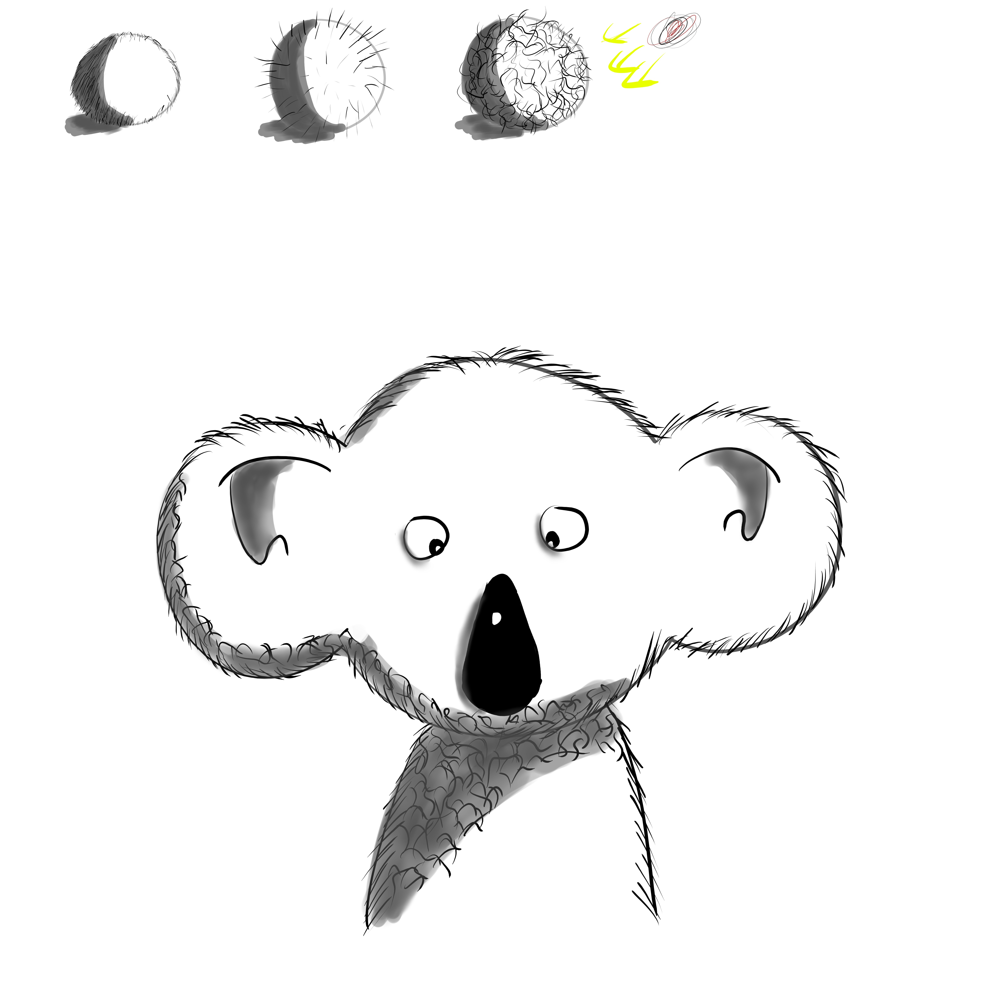

@def title = "Running Julia baremetal on an Arduino"
@def tags = ["css"]

# This is the Title of the article (h1)

You found my CSS test page! Hello!

## This is a subtitle (h2)

Excepturi ipsa ut commodi et. Beatae sit quo laboriosam. Quisquam qui dolores est repellendus voluptas quo. Repellendus ipsam vel minima aut repudiandae molestiae aut. Placeat rem non impedit dolore qui aut saepe illo. Optio fugiat odio quo dolorum earum.

@@imgcenter @@

### This is a subsubtitle (h3)

Eaque similique quo autem quia et voluptatem ut libero. Et nemo qui vero enim qui voluptate quaerat. Aut consequatur sed nisi. Saepe nemo assumenda neque eius et earum non.[^note]

#### This is a subsubsubtitle (h4)

Repellat rerum et architecto dolores doloremque qui. Placeat nemo dolorem voluptatem perferendis minus aliquam illum. Corporis in cumque culpa consequatur quibusdam autem eum molestiae. Vel voluptatum officiis sit voluptas odio.[^note2]

@@table
| Address     | Name  | Bit 7  | Bit 6  | Bit 5  | Bit 4  | Bit 3  | Bit 2  | Bit 1  | Bit 0  | Page |
|:-----------:|:-----:|:------:|:------:|:------:|:------:|:------:|:------:|:------:|:------:|:----:|
| 0x05 (0x25) | PORTB | PORTB7 | PORTB6 | PORTB5 | PORTB4 | PORTB3 | PORTB2 | PORTB1 | PORTB0 | 100  |
| 0x04 (0x24) | DDRB  | DDR7   | DDR6   | DDR5   | DDR4   | DDR3   | DDR2   | DDR1   | DDR0   | 100  |
@@

##### This is a subsubsubsubtitle (h5)

Eos dolor nemo in laborum ex voluptates sit impedit. Iste facilis a illo aspernatur rem at. Omnis nisi eveniet quis aut accusamus asperiores. Ullam necessitatibus ipsa in.

REPL:

```julia-repl
julia> function foo(arg, barg)
    @show arg + barg
end
```

Regular:

```julia
function foo(arg, barg)
    @show arg + barg
end
```

!!! danger "Danger `code`"
    This is a Danger `code`

!!! warning "Warning `code`"
    This is a warning

!!! note "Note `code`"
    This is a note `code`

!!! tip "Tip `code`"
    This is a tip `code`

!!! generic "Generic `code`"
    This is a generic `code`

[^note]: This is a footnote!
[^note2]: This is another footnote!
