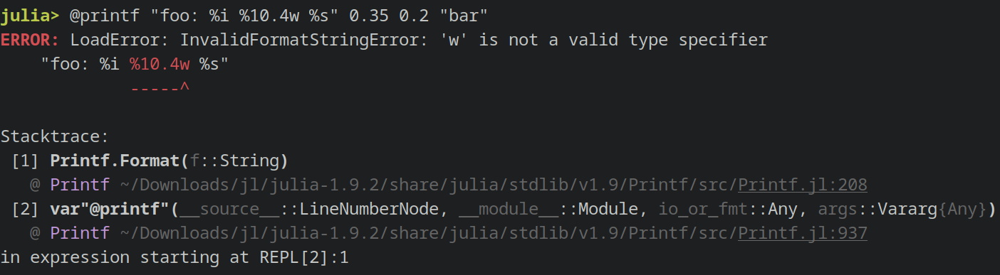

@def title = "Error Shrinking: The Good, the Bad and the Ugly"
@def tags = ["julia", "testing", "errors", "PBT", "Supposition.jl"]
<!--@def rss_description = "We're looking at how errors and their messages in Julia behave (or don't!) when they interact with property based testing using Supposition.jl."-->

# Error Shrinking: The Good, the Bad and the Ugly

Errors! Love 'em or hate 'em, one thing is undeniable: we all encounter them, sooner or later.
I've been thinking about errors quite a bit recently, in part because of [a recent post](https://public.tecosaur.net/JuliaErrors.html)
by `@tecosaur` about improving the error experience in Julia:

> Julia’s error messages currently effectively communicate that an error has occurred, and the general nature of it, but fail to do much beyond that.

The post mostly focuses on the presentation & interactive side of things, which _really_ needs some work & better library support. There's one big thing
that wasn't mentioned though: When we get an error, what options beside manually drilling into it do we have to debug such an error?

## Good Errors

First, let's set a baseline; what kinds of errors do we currently have that do a good job of communicating what the root cause is?
Take `sin(Inf)` for example:

```julia-repl
julia> sin(Inf)
ERROR: DomainError with Inf:
sin(x) is only defined for finite x.
Stacktrace:
 [1] sin_domain_error(x::Float64)
   @ Base.Math ./special/trig.jl:28
 [2] sin(x::Float64)
   @ Base.Math ./special/trig.jl:39
 [3] top-level scope
   @ REPL[2]:1
```

UX-wise, this is a good error! We get a clear message what caused the error (`Inf`), where it occurred (in `sin`), why it occured (the function is only defined for finite inputs)
and to top it off, the _type_ of the error is specific to this kind of mathematical problem:

```julia-repl
help?> DomainError
search: DomainError LoadError DivideError InitError BoundsError AssertionError InexactError

  DomainError(val)
  DomainError(val, msg)

  The argument val to a function or constructor is outside the valid domain.

[...]
```

This is great, because it means programmers can check for the type in `try`/`catch` to explicitly handle `DomainError`s that weren't accounted for beforehand
and can give domain-specific error messages.

```julia
function process_angle(angle::Float64)
    try
        x = sin(angle)
        ... # further processing
    catch e
        # throw an application specific error that we know must have been user error
        # and can be displayed specially in our frontend
        e isa DomainError && throw(InputError("The input angle must be finite!"))
        # fall back to a different kind of error that we perhaps show differently
        # and/or only write to a log
        throw(GenericError("An Unknown error occured"))
    end
end
```

!!! note "`throw` in `catch`"
    `throw` in a `catch` block keeps the existing errors around in a stack of errors, which can be inspected later on using `current_exceptions`.

## Bad Errors

Of course, with good comes bad too; in particular, liberal use of the overly generic `error` leads to quite hard-to-work-with errors,
as `@tecosaur` talks about in [his blogpost](https://public.tecosaur.net/JuliaErrors.html).
Since the type of all uses of `error` are the same (namely `ErrorException`, a quite awful name), it's not possible to handle different kinds of errors explicitly,
and as a result a programmer always has to fall back to the most generic handling possible. Currently, there are 736 places in Base & its standard library
that use the `error` function (as counted by grepping for `" error\("` in the language repo), and I'm pretty sure those uses won't all have the same meaning.

Why is this bad? Well, as `@tecosaur` writes, `ErrorException` contains nothing but a `String` that's intended for user display. A programmer has no way
to interrogate what actually happened at runtime, and must defer to the user. If the error message is not written well or the context surrounding that
call has a different semantic than the one the code path using `error` assumes, it's incredibly easy for users to be confused about what's going on.
This is especially prone to happen when the source of the error and the higher level interface the user interacts with are far removed from
each other. There's a good list of examples in [this discourse thread](https://discourse.julialang.org/t/please-stop-using-error-and-errorexception-in-packages-and-base/12096?u=sukera)
from almost 6 years ago, so the problem is definitely not new.

On top of this though, anyone wishing to _handle_ that kind of error only has the raw string to work with, and can't customize the presentation of that error
to the user. This is not exclusive to `error` though, `DomainError` from `sin` shares that same problem (and `@tecosaur` mentioned much the same in his post).

This annoyed me enough that two years ago, I [made a PR](https://github.com/JuliaLang/julia/pull/45366) to the Printf standard library
that changes all uses of `ArgumentError` thrown when parsing the format string to an `InvalidFormatStringError`, which contains metadata about
what exactly & where it went wrong. This is metadata is then used only during displaying to actually format the error message in a way
that is good to read.

Before:

@@imgcenter

@@

After:

@@imgcenter

@@

This is crucial information! Not only can there be multiple different locations where an error occured, but not having this information be part of the error
itself means that anyone wanting to display that error differently has no chance of doing so, if all they're given is a `String` from an `ArgumentError`, 
`DomainError` or even `ErrorException`.

## The Ugly

Alright, we've seen some good and some bad - I've also teased some Ugly in the title, and it's time we get to that.
See, I've recently released a property based testing/fuzzing framework called [Supposition.jl](https://github.com/Seelengrab/Supposition.jl) (go check it out!),
inspired by the python library [Hypothesis](https://hypothesis.readthedocs.io/en/latest/). One of the really cool things Supposition.jl can do is find the
minimal input that produces an error (if one can occur). For example, if we want to fuzz `sin` we can relatively quickly find the `DomainError` with a very naive
property:

@@imgcenter

@@

And all is well, since that is very much expected. For functions that have a range of values that can error, Supposition.jl tries to minimize the input that ends up
throwing the error:

```julia
julia> using Supposition

julia> function double_rotation(radians::Float64)
           0.0 <= radians < 2π || throw(ArgumentError("The angle is expected to be in radians!"))
           # keep the result in radians
           mod(2*radians, 2π)
       end

julia> @check function allAngles(angle=Data.Floats{Float64}())
           double_rotation(angle) isa Float64
       end;
┌ Error: Property errored!
│   Description = "allAngles"
│   Example = (angle = 6.283185307179587,)
│   exception =
│    ArgumentError: The angle is expected to be in radians!
│    Stacktrace:
│     [1] double_rotation
│       @ ./REPL[2]:2 [inlined]
│     [2] allAngles
│       @ ./REPL[35]:4 [inlined]
└ @ Supposition ~/Documents/projects/Supposition.jl/src/testset.jl:275
Test Summary: | Error  Total  
allAngles     |     1      1  
```

The input that Supposition.jl found is `6.283185307179586`, which is exactly `2π`:

```julia
julia> 2π
6.283185307179586
```

which is the excluded upper bound that `double_rotation` requires.

So far so good; we can easily adjust the test so only valid inputs are used:

```julia
julia> @check function allAngles(angle=Data.Floats{Float64}())
           assume!(0.0 <= angle < 2π)
           
           double_rotation(angle) isa Float64
       end;
Test Summary: | Pass  Total  
allAngles     |    1      1  
```

and the property passes. Granted, the property here is very trivial, but it's these kinds of seemingly trivial properties that are great for looking for places
that error unexpectedly and/or that should be documented. If you want to learn more about this kind of incremental documenting of valid inputs, I've
written about this extensively [in the documentation of Supposition.jl](https://seelengrab.github.io/Supposition.jl/stable/Examples/docalignment.html).

Of course, `double_rotation` is committing a bit of a sin here, by simply using `ArgumentError` and a `String`. Imagine now someone comes along
and thinks "this error message is really bad, let's communicate which number exactly caused the error":

```julia
julia> function double_rotation(radians::Float64)
           0.0 <= radians < 2π || throw(ArgumentError("The angle is expected to be in the interval [0, 2π), i.e. in radians! Got: $radians"))
           # keep the result in radians
           mod(2*radians, 2π)
       end
double_rotation (generic function with 1 method)

julia> double_rotation(42.0)
ERROR: ArgumentError: The angle is expected to be in the interval [0, 2π), i.e. radians! Got: 42.0
Stacktrace:
 [1] double_rotation(radians::Float64)
   @ Main ./REPL[39]:2
 [2] top-level scope
   @ REPL[40]:1
```

UX wise, this is an obvious improvement; unfortunately, Supposition.jl has no knowledge about this. Because the error message differs,
the root cause of the error might be completely different too, and so Supposition.jl warns you that it got a different error.. for every input it tries:

```julia
julia> @check function allAngles(angle=Data.Floats{Float64}())    
           double_rotation(angle) isa Float64
       end;
┌ Warning: Encountered an error, but it was different from the previously seen one - Ignoring!
│   Error = ArgumentError: The angle is expected to be in the interval [0, 2π), i.e. radians! Got: 3.690705114706145e155
│   Location = double_rotation at REPL[39]:2 [inlined]
└ @ Supposition ~/Documents/projects/Supposition.jl/src/teststate.jl:109

[...] # repeat the above log entry for various minimized input values a bunch of times

┌ Warning: Encountered an error, but it was different from the previously seen one - Ignoring!
│   Error = ArgumentError: The angle is expected to be in the interval [0, 2π), i.e. radians! Got: -368.8491610835767
│   Location = double_rotation at REPL[39]:2 [inlined]
└ @ Supposition ~/Documents/projects/Supposition.jl/src/teststate.jl:109
┌ Error: Property errored!
│   Description = "allAngles"
│   Example = (angle = -368.84916108357675,)
│   exception =
│    ArgumentError: The angle is expected to be in the interval [0, 2π), i.e. radians! Got: -368.84916108357675
│    Stacktrace:
│     [1] double_rotation
│       @ ./REPL[39]:2 [inlined]
│     [2] allAngles
│       @ ./REPL[43]:2 [inlined]
└ @ Supposition ~/Documents/projects/Supposition.jl/src/testset.jl:275
Test Summary: | Error  Total  
allAngles     |     1      1  
```

ultimately reporting *a* value (the first one it found), but not one that's close to the actual boundary of the check throwing that error.
The really unfortunate part of this is that a custom error type also doesn't help here, if it doesn't have some form of ordering
defined on it as well. Supposition.jl has no choice - it has no knowledge about individual error types and whether or not you
can order them. It _could_ attempt to find an ordering through reflecting on the fields of the object it receives, but that's
not stable either (though it could work for things like `ArgumentError`). For example, what should happen when a field in the error object just isn't orderable?

It gets worse: What if there are _actually_ distinct error types being thrown for different inputs? How should they be compared? They may be completely
unrelated and may not have an obvious ordering, even through reflection on the fields. The semantic meaning is application specific after all.
My gut feel is that this case should really just fall back to ignoring the other errors and focusing on the one we already have, so that the two (or more!)
errors we encountered during shrinking can be dealt with by a developer seperately. That way, we're at least limiting the problem to comparing objects
of egal type, and hopefully dealing with distinct failure modes too. From the POV of Supposition.jl, I'll probably provide a hook to let users
define an ordering on their type, if there is one, defaulting to the current behavior if there isn't. The details of what an error exactly looks like
is (I think) internal too, so while looking at the message of e.g. an `ArgumentError` can break in the future, it might be good to provide a default
fallback for some of these too, to allow them to shrink better.

This is the ugly part of errors; even when you have taken a bit more care to design them with good UX, they are still a non-standard exit condition
that all of your tooling needs support for to take proper advantage of. "Throw and forget" doesn't really work all that well when you want to be smart
about actually debugging them.

## Conclusion

Alright, this about sums it up; there are good & simple things you can do with errors in Julia that help users to debug their code, but even those
aren't good enough when it comes to writing fuzzable errors. There's a bit of design space left here that I hope to explore in the future
with Supposition.jl! In the mean time, moving from naive `String`-wrapper errors towards custom subtypes of `Exception` is definitely a boon; if not (yet)
for Supposition.jl, then at least for your users :)
