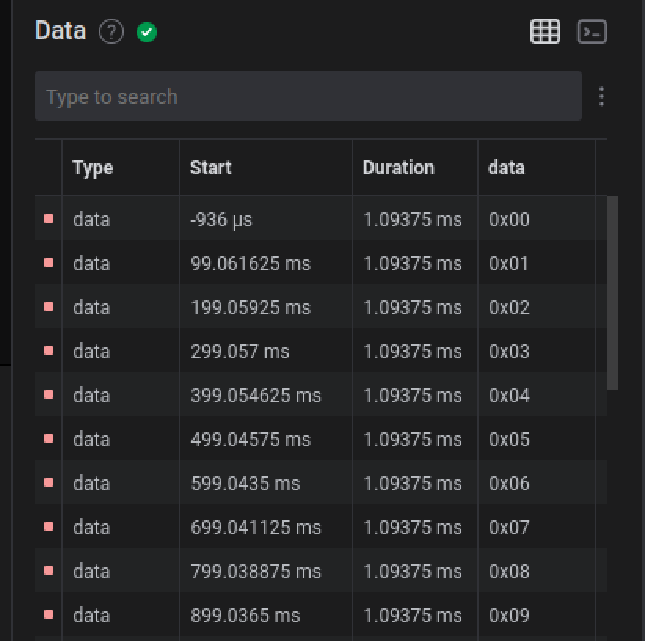

@def title = "Julia Abstractions for Arduino registers"
@def tags = ["julia", "c", "arduino", "abstraction", "µC"]
@def rss_description = "A followup post about building zero-cost abstractions for Julia on microcontrollers using a few new support packages."
@def rss_pubdate = Date(2022,11,08)

# Julia Abstractions for Arduino registers

\toc

## Preamble

It's been a while since I've messed around with julia on an arduino - I honestly did not expect people to be interested in this
as much as they have been! Since there has been lots of progress on my bachelors' thesis, I thought it would be ok to
procrastinate a little bit again and clean up the "just get it to work" version of the blinking LED project.

So in this installment of "things I do when I forcefully make some time", we'll be looking at some ways we can abstract the messiness of
the hardware underneath the code away, making it easier to write new code interacting with the hardware and generalizing
the ad-hoc implementation from the previous article for more than just one specific use case. All the while not losing any of the
guarantees about volatility we learned to communicate last time.

This post will dive more into how the abstraction I chose ended up looking and how to use them, than what the hardware underneath does.
That said, I will take a small look into how zero-cost these abstractions are - exciting stuff!

## A small recap

In case you, dear reader, are not up to date with the current state of blinking an LED in julia, here's a small reminder about what [I ended
up with last time][previously]:

```julia
const DDRB  = Ptr{UInt8}(36)
const PORTB = Ptr{UInt8}(37)
const DDB1   = 0b00000010
const PORTB1 = 0b00000010
const PORTB_none = 0b00000000 # We don't need any other pin - set everything low

function volatile_store!(x::Ptr{UInt8}, v::UInt8)
    return Base.llvmcall(
        """
        %ptr = inttoptr i64 %0 to i8*
        store volatile i8 %1, i8* %ptr, align 1
        ret void
        """,
        Cvoid,
        Tuple{Ptr{UInt8},UInt8},
        x,
        v
    )
end

function keep(x)
    return Base.llvmcall(
        """
        call void asm sideeffect "", "X,~{memory}"(i16 %0)
        ret void
        """,
        Cvoid,
        Tuple{Int16},
        x
)
end

function main_keep()
    volatile_store!(DDRB, DDB1)

    while true
        volatile_store!(PORTB, PORTB1) # enable LED

        for y in Int16(1):Int16(3000)
            keep(y)
        end

        volatile_store!(PORTB, PORTB_none) # disable LED

        for y in Int16(1):Int16(3000)
            keep(y)
        end
    end
end
```

We have some global constants for the limited set of registers that are required for a blinking LED example, a function for setting
the contents of a register via its address in the memory map, another function for making sure some data survives through the compiler and into the
final assembly and doesn't get eliminated, and finally the actual code showcasing the example. All in all, a pretty ugly 76 LOC
for a meager result.

In the first step to improve this and to make writing new projects using those same building blocks easier,
I ended up writing a new julia package handling all of this, while providing the utilities required - [`AVRDevices.jl`][avrdevices].
It's heavily inspired by the awesome [avr-rust project][avr-rust], which was very helpful in figuring out what kinds of features
would be nice to have in a library like this.

The second step was wrapping the compiler functions up into its own package as well, [`AVRCompiler.jl`][avrcompiler]. There's a bunch of stuff that
could be done there, like having `JLL`s from [BinaryBuilder][binarybuilder] for linking and flashing onto a connected device, or maybe just
relying on the already-required AVR compatible LLVM. I haven't gotten to that yet though and so it's just the existing functions, wrapped
up into a package for now.

## Dev-UX! A kingdom for nice Dev-UX!

So, what *are* actually a nice set of features here? Some form of static checking would be nice, to be sure that I can't construct an
invalid configuration/register state from unrelated constants on accident. Also, building the desired state up step-by-step and only
writing it out once - writing to a register takes much more time if done on a per-bit basis, and if we're hardcoding a static
configuration it's also much nicer to have it all constant fold away into a single write to a register. 

With this wishlist in mind, here's what I've come up with:

```julia
struct Register{Reg, T <: Base.BitInteger}
    ptr::Ptr{T}
    Register{Reg, T}(x::Ptr{T}) where {Reg, T} = new{Reg, T}(x)
    Register{Reg, T}(x::Base.BitInteger) where {Reg, T} = new{Reg, T}(Ptr{T}(x % UInt)) # Ptr only takes Union{Int, UInt, Ptr}...
end

struct Pin{RT, Reg, Bit, Mask}
    function Pin{Reg, bit}() where {Reg, bit}
        T = typeof(Reg)
        mask = eltype(Reg)(1 << (bit - 1))
        new{T, Reg, bit, mask}()
    end
end

struct RegisterBits{Reg, T}
    bits::T
end
```

The first type is just a wrapper around a raw pointer - it will be the equivalent of what `const DDRB  = Ptr{UInt8}(36)` was in the
ad-hoc implementation, representing a register. The second type is a single bit of one of those registers. It will be used for reading
& writing just that bit, as well as for building objects of the third type, which represents the bitmasks we use when building a successive value.

For reading registers/pins, I've implemented `getindex(::T)`, which is just a forward to the `volatile_load` of the correct pointer size:

```julia
Base.getindex(r::Register) = volatile_load(r)
```

This does hook into the same exact machinery that regular `Array`s in julia use - so in a sense, `Register` and `Pin` are a kind of array!

For `Pin`s, at the moment this has a `volatile_load` of the register and masks the bit out, though I may change that later to a simple
bit load (`BLD`) instruction, so that a load requires fewer cycles. I haven't actually clocked/checked whether this is worth it though, since
using that instruction means I have to get the value out of a special bit of the `SREG` register (which could be as expensive as just loading directly).

Similarly, I've defined `setindex` to allow setting a whole value or just a single bit:

```julia
Base.setindex!(r::Register{Reg, T}, data::T) where {Reg, T} = volatile_store!(r, data)
Base.setindex!(r::Register{Reg, T}, rb::RegisterBits{Reg, T}) where {Reg, T} = volatile_store!(r, rb.bits)
Base.setindex!(r::RT, _::Pin{RT, Reg, b, m}) where {RT, Reg, b, m} = volatile_store!(r, m)
```

These definitions allow this syntax to work[^cmacro] :

```julia
val = Register[] # load the current value of the register
val = Pin1[] # load a Boolean value depending on whether or not `Pin1` is set
Register[] = val # write a value to the register
Pin1[] = true # set the bit named `Pin1` - errors if the RHS is not a boolean
Register[] = Pin1 # set only `Pin1` of `Register` to 1 and the rest to 0
Register[] = Pin1 | Pin2 # set `Pin1` and `Pin2` of `Register` with a single write, the rest to 0
Register[] |= Pin1 # set `Pin1` but leave the others alone
```

`Pin1 | Pin2` is also implemented, which returns a `RegisterBits` value holding the bitwise-ORed masks of each pin.
The same goes for `&`, unary `~` (for bitwise negation of the pin mask) and `xor`.

In the same vein, `val = Pin[]` and `Pin[] = true` or `Pin[] = false` get, set or clear the respective bit of the register the pin is on.

What's very important here is that the type parameters of `Register{Reg, T}` and e.g. `RegisterBits{Reg, T}` have to match - thereby enforcing
that we can only use `RegisterBits` intended for that very `Register` to be used when setting the value. The same is the case for the
`Pin1 | Pin2` style operations of combining pins - the targeted register has to match.

These very general definitions of the structs themselves have found their new home in the `Common` submodule of `AVRDevices.jl`, since they're
common to all AVR chips. They can probably be used for any chip that memory-maps registers to specific addresses, but factoring that out
can easily be done later.

Defining registers and their pins now is as simple as having a microcontroller specific submodule with global constants:

```julia
# a shorthand - `R` just makes the register name available for dispatch, to get the type safety we wanted
# `UInt8` is just the native size of the register
const Ru8{R} = Register{R, UInt8}

const PINB   = Ru8{:PINB}(0x23)
const DDRB   = Ru8{:DDRB}(0x24)
const PORTB  = Ru8{:PORTB}(0x25)

for p in 0:7
    _p = p+1
    pinb  = Symbol(:PINB,  p)
    ddrb  = Symbol(:DDRB,  p)
    portb = Symbol(:PORTB, p)
    # we're creating the pin bindings in the submodule dynamically
    @eval begin
       const $pinb  = Pin{PINB,  $_p}()
       const $ddrb  = Pin{DDRB,  $_p}()
       const $portb = Pin{PORTB, $_p}()
       export $pinb, $ddrb, $portb
    end
end

# ...
# and so on for ~600 LOC :')
```

I spent a full day on these constants, writing them out by hand. I only learnt afterwards that I could have generated these from some
XML file :') I'm telling myself that I didn't know the exact interface I wanted to use yet (which was true, the interface evolved
while writing out pins & bits one by one), but I'll definitely do that for the next chip. Regardless, now all of the registers and their
individual pins should be defined as constants under the `AVRDevies.ATmega328p` submodule, since those pins and registers
are for that chip. Full disclosure though, I do not own other chips that I could target with this, so unless someone else wants to
contribute, it'll probably stay like this for now.

[^cmacro]: To be clear here - this allows me to use the exact same syntax for reading & writing a single bit of a register while also using that same syntax in `if` branches. Working on this syntax also lead to challenging some friends of mine to express the exact same convenience in C, which nerdsniped them for about an hour.. :) Can you figure out the trick? The rules were the following: 1) `val = FOOBAR` reads the bit `FOOBAR` of a register as a boolean value (no truthiness); 2) `FOOBAR = true` must write only that bit; 3) `if FOOBAR` must also be possible for branching. You are free to replace `FOOBAR` with whatever you want, as long as it's the exact same in all three places.

## A new blinking Hope

Well, with the definitions from above, the small blinking LED example truly is small now! It looks like this:

```julia
module blink_led

using AVRDevices.Common
using AVRDevices.ATmega328p

function main()
    DDRB[] = DDRB1
    
    while true
        PORTB[] =  PORTB1
        delay_ms(1000)
        
        PORTB[] = ~PORTB1
        delay_ms(1000)
    end
end

end
```

Yes, that's it! Truly as small as it should be - and the best part? The generated assembly is near identical, modulo some differences
in the timing loops:

```julia
julia> using AVRCompiler, blink_led

julia> AVRCompiler.builddump(blink_led.main, ())
[ Info: Creating compiler job for 'main(())'
[ Info: Compiling AVR ASM for 'main(())'
[ Info: Bulding LLVM IR for 'main(())'

/tmp/jl_KdR68K:     file format elf32-avr


Disassembly of section .text:

00000000 <julia_blink_led_main>:
   0:	0f 93       	push	r16
   2:	1f 93       	push	r17
   4:	42 e0       	ldi	r20, 0x02	; 2
   6:	44 b9       	out	0x04, r20	; 4
   8:	61 e0       	ldi	r22, 0x01	; 1
   a:	70 e0       	ldi	r23, 0x00	; 0
   c:	80 e0       	ldi	r24, 0x00	; 0
   e:	90 e0       	ldi	r25, 0x00	; 0
  10:	21 e0       	ldi	r18, 0x01	; 1
  12:	39 e0       	ldi	r19, 0x09	; 9
  14:	5d ef       	ldi	r21, 0xFD	; 253
  16:	45 b9       	out	0x05, r20	; 5
  18:	06 2f       	mov	r16, r22
  1a:	17 2f       	mov	r17, r23
  1c:	e0 2f       	mov	r30, r16
  1e:	f1 2f       	mov	r31, r17
  20:	a8 2f       	mov	r26, r24
  22:	b9 2f       	mov	r27, r25
  24:	11 97       	sbiw	r26, 0x01	; 1
  26:	01 f4       	brne	.+0      	; 0x28 <julia_blink_led_main+0x28>
			26: R_AVR_7_PCREL	.text+0x24
  28:	31 96       	adiw	r30, 0x01	; 1
  2a:	0d 33       	cpi	r16, 0x3D	; 61
  2c:	11 05       	cpc	r17, r1
  2e:	0e 2f       	mov	r16, r30
  30:	1f 2f       	mov	r17, r31
  32:	01 f4       	brne	.+0      	; 0x34 <julia_blink_led_main+0x34>
			32: R_AVR_7_PCREL	.text+0x20
  34:	a2 2f       	mov	r26, r18
  36:	b3 2f       	mov	r27, r19
  38:	11 97       	sbiw	r26, 0x01	; 1
  3a:	01 f4       	brne	.+0      	; 0x3c <julia_blink_led_main+0x3c>
			3a: R_AVR_7_PCREL	.text+0x38
  3c:	55 b9       	out	0x05, r21	; 5
  3e:	06 2f       	mov	r16, r22
  40:	17 2f       	mov	r17, r23
  42:	e0 2f       	mov	r30, r16
  44:	f1 2f       	mov	r31, r17
  46:	a8 2f       	mov	r26, r24
  48:	b9 2f       	mov	r27, r25
  4a:	11 97       	sbiw	r26, 0x01	; 1
  4c:	01 f4       	brne	.+0      	; 0x4e <julia_blink_led_main+0x4e>
			4c: R_AVR_7_PCREL	.text+0x4a
  4e:	31 96       	adiw	r30, 0x01	; 1
  50:	0d 33       	cpi	r16, 0x3D	; 61
  52:	11 05       	cpc	r17, r1
  54:	0e 2f       	mov	r16, r30
  56:	1f 2f       	mov	r17, r31
  58:	01 f4       	brne	.+0      	; 0x5a <julia_blink_led_main+0x5a>
			58: R_AVR_7_PCREL	.text+0x46
  5a:	a2 2f       	mov	r26, r18
  5c:	b3 2f       	mov	r27, r19
  5e:	11 97       	sbiw	r26, 0x01	; 1
  60:	01 f4       	brne	.+0      	; 0x62 <julia_blink_led_main+0x62>
			60: R_AVR_7_PCREL	.text+0x5e
  62:	00 c0       	rjmp	.+0      	; 0x64 <julia_blink_led_main+0x64>
			62: R_AVR_13_PCREL	.text+0x16
```

Don't mind the relative jump labels, the output is pre-linking :)

The timing loops are all inlined since the functions are very small, but if you squint, they are still there. Note the instructions at
`0x16` and `0x3c`:

```avrasm
...
   4:	42 e0       	ldi	r20, 0x02	; 2   -- this is 0b00000010
...
  14:	5d ef       	ldi	r21, 0xFD	; 253 -- this is 0b11111101
...
  16:	45 b9       	out	0x05, r20	; 5   -- Address 5 is PORTB
...
  3c:	55 b9       	out	0x05, r21	; 5
...
```

The whole chain of `PORTB[] = PORTB1` and `PORTB[] = ~PORTB1`, which is just defined as regular old julia functions operating on constants,
got compiled away to _a single `out`_! If that's not a zero-cost abstraction, it's pretty darn close. Granted, the assembly could probably be
smaller still (the timing code is mostly concerned with being somewhat accurate, not small), but I haven't looked into how to make LLVM
optimize for space yet and how to do that from julia.

## Serial Experiments Julia 

And now for a bit of a surprise - at least half of my motivation for cleaning up the utilities for reading & setting registers
in the first place was to implement a small serial library. I wanted to know how using the new register definitions would feel
for a more involved project, as well as how zero-cost the abstractions cooked up actually are.

I've got to say - I'm VERY pleased with how it turned out. Without further ado, here's the initialisation logic for the `USART0`
on this `ATmega328p`:

```julia
@enum Parity None Even Odd
@enum StopBits One Two

function calc_baud(baud)
    ubrr = (((CPU_FREQUENCY_HZ() ÷ 16) ÷ baud) - 0x1) % UInt16
    high = (ubrr >> 0x8) % UInt8
    low  =  ubrr         % UInt8
    high, low
end

struct USART0{N} <: IO
    function USART0{ndata}(; baud::Int=9600, async::Bool=false, parity::Parity=None, nstop::StopBits=Two) where ndata
        hi, lo = calc_baud(baud)
        UBBR0H[] = hi
        UBBR0L[] = lo

        # now enable the USART
        UCSR0B[] = RXEN0 | TXEN0

        if async 
            UCSR0A[] |= U2X0
        end

        c_mask = zero(UCSR0C)
        # set stop bits
        if nstop === One
            # nothing to set
        elseif nstop === Two
            c_mask |= USBS0
        end
        
        # set frame length
        if ndata == 0x5
            # no extra registers
        elseif ndata == 0x6
            c_mask |=                   UCSZ00
        elseif ndata == 0x7
            c_mask |=          UCSZ01
        elseif ndata == 0x8
            c_mask |=          UCSZ01 | UCSZ00
        elseif ndata == 0x9
            c_mask |= UCSZ02 | UCSZ01 | UCSZ00
        end
        
        # set parity
        if parity === None
            # no bits set
        elseif parity === Even
            c_mask |= UPM01
        elseif parity === Odd
            c_mask |= UPM01 | UPM00
        end
        
        UCSR0C[] = c_mask
        
        new{ndata}()
    end
end
USART0(;kwargs...) = USART0{0x8}(;kwargs...)
```

Not all modes supported by the hardware are also already supported by my software - 9-bit frame length in particular is a bit tricky
when writing data, as there's a lot of shifting to do..

Regardless, the default of 9600 baud, a framewidth of 8 bits and some stop bits, together with some functions for actually writing data
to this thing can be used to compile this example code:

```julia
module uart_example

using AVRDevices.Common
using AVRDevices.ATmega328p

function main()
    s = USART0()

    idx = 0x0
    while true
        write(s, idx)
        idx += 0x1
        delay_ms(100)
    end
end

end # module uart_example
```

into this rather beautiful assembly:

```julia
julia> using AVRCompiler, uart_example

julia> AVRCompiler.builddump(uart_example.main, ())
[ Info: Creating compiler job for 'main(())'
[ Info: Bulding LLVM IR for 'main(())'
[ Info: Compiling AVR ASM for 'main(())'

/tmp/jl_ZgNG5F:     file format elf32-avr


Disassembly of section .text:

00000000 <julia_uart_example_main>:
   0:	af 92       	push	r10
   2:	bf 92       	push	r11
   4:	cf 92       	push	r12
   6:	df 92       	push	r13
   8:	ff 92       	push	r15
   a:	0f 93       	push	r16
   c:	1f 93       	push	r17
   e:	10 92 c5 00 	sts	0x00C5, r1	; 0x8000c5 <julia_uart_example_main+0x8000c5>
  12:	87 e6       	ldi	r24, 0x67	; 103
  14:	80 93 c4 00 	sts	0x00C4, r24	; 0x8000c4 <julia_uart_example_main+0x8000c4>
  18:	88 e1       	ldi	r24, 0x18	; 24
  1a:	80 93 c1 00 	sts	0x00C1, r24	; 0x8000c1 <julia_uart_example_main+0x8000c1>
  1e:	8e e0       	ldi	r24, 0x0E	; 14
  20:	80 93 c2 00 	sts	0x00C2, r24	; 0x8000c2 <julia_uart_example_main+0x8000c2>
...
```

which _again_ compiles all that "dynamic" function work completely away into just those 4 stores to `UCSR0B`, `UCSR0C`, `UBBRH` and `UBBRL`,
otherwise known as the control registers for `USART0`. Flashing in the usual fashion, as well as connecting a cheap knock-off logic analyzer I recently
bought (this is not a Saleae - I cannot afford those!) to the output pins gives us...

{{video ./uart_example.webm}}

Another few days well spent, I say :D The thumb is me holding down the "Reset" button of the arduino, so I can capture the first sent byte.
Also apologies for the video quality - there's a lot going on here visually and this bad version is still 3.3MB :/

And here's a view of the received data as a table, from the wonderful Saleae software:

@@imgcenter

@@

Their software is REALLY nice, even though my bootlegged, third-party, underpowered logic analyzer can absolutely not keep up with all 24MS/s :)
I do wish it had HiDPI support on my archlinux/wayland setup, but since this is not even close to being a supported platform, I guess that's fair.

The 100ms delay between each sent packet is nicely visible and not too far off, even though it's just a rough busy waiting approach.

## Limitations & UX in development

Since I did it last time, I'll do it again and write a bit about things & problems I encountered during development that are probably
totally fixable and/or are just a sign that this is a really untrodden ~~~<s>road</s>~~~ ~~~<s>path</s>~~~ piece of land. But that's ok!

One thing is certain: runtime errors (which all errors in julia are, save for syntax errors) are difficult to debug. Since the functions
of the runtime that would be called are not there, almost everything aside from the error is optimized away. Moreover, since they often
have dynamic allocations and other nastiness, often the only way to figure out what is happening when the LLVM-IR or ASM doesn't look
like you'd expect is to jump into `@code_llvm`, dump the LLVM module that is generated, figure out whether there's dynamic dispatch
(requiring the runtime) with JET.jl and Cthulhu.jl and thus having to be VERY careful not to be type unstable. The good news is that
these are easily detectable in the IR, because they have a very distinct pattern to them, since throwing errors or dispatching dynamically
have to interact with the runtime. Possible solutions are 

   1) make them both compile time errors? There's no stack unwinding and dynamic dispatch is weird
   2) Highjack the USART on an error to print the error (no idea how we'd print stacktraces?) and make the dynamic dispatch require all possible methods to be compiled as well

I can say with high confidence that 1) is much easier than 2) - it's "just" a pass over LLVM IR that ends up throwing an error. The latter is
definitely a big engineering project on its own though and also requires decisions in terms of how the USART should be used. This is not
a microcontroller OS after all and such decisions can't necessarily be made by this library providing that functionality - the USART may be
configured differently after all (though it may be possible to check if it's enabled, enable if necessary, otherwise just write the error out..).

And speaking of errors: Keen eyes looking at the `AVRDevices.jl` repository will have noticed one curious thing: there are no tests!
None! Zero! I know that this isn't good, but it's not like I have CI set up for arduino deployment. I only have one arduino and testing
most of the functionality requires writing to (for regular systems) small pointers that are most certainly out of range of allocations.
Maybe something could be rigged up with `qemu`, but I doubt this will be particularly workable once I start to work with more complicated
interactions, like writing to an SD card or similar. For now, I'm trying to make use of the abstractions as best as I can and isolate
some computations (like the values that will be written into the USART control registers derived from a desired BAUD rate) to at least
make it possible to add some tests later.

In terms of "avoiding dynamicness", there's another issue. Some may have wondered why my example code for UART just increments a counter,
instead of writing a more traditional `"Hello World!"` string - well, the reason for that is that such a string constant is internally
stored as some data blob. In the LLVM IR, this is then referenced as a literal pointer to the julia object - we're lying to the compiler
after all and it just thinks that it always has access to an object it stores like that, which is obviously not the case if we then take
the generated IR, create AVR assembly out of it and write it to a microcontroller, leaving the pointer pointing to nothingness.
Perfectly fixable by having a custom compiler pass run over the LLVM IR, check out referenced global variables (they're pretty easy to spot)
and replace them with constant references in the LLVM module. It just requires time to develop that pass that I have not yet had available :) 

There's a similar situation with tuples, which DO make it into the IR, but which (for some reason unkown to me) do not survive the trip
to AVR assembly. I have not yet investigated that, but this will probably happen in the course of trying to get strings to work.

And finally, another headache: 64 bit integers! Or any "native" datatype that doesn't have actual native hardware to use. You have to be
really careful not to use too many general purpose registers, otherwise LLVM will yell at you for not being able to allocate registers,
due to being helpful enough to emulate those larger types in software. My hope is that this can be helped in the future by making the
default integer type be of word size (or 16-bit, on this platform?), which would help tremendously with not having to walk on eggshells
while developing.

----

All that being said, if you have an arduino (or any device, really) with an ATmega328p and want to play around with this, the code I
used for this is up on github now:

 * [AVRDevices.jl][avrdevices] - Device definition, common functionality and examples (just blinking LEDs and UART for now)
 * [AVRCompiler.jl][avrcompiler] - Utilities for compiling Julia to AVR

Contributions are always welcome, judging from the list of things above this project is not going to run out of work any time soon :) 

Also a big thanks to Julian Samaroo from the [JuliaLang Slack][jlslack] channel `#static-compilation`, who
had a lot of ideas and Julia internals expertise when trying to figure out why strings don't (yet) work.

## Links & References

 * [The AVR-Rust project][avr-rust]
 * [AVRDevices.jl][avrdevices]
 * [AVRCompiler.jl][avrcompiler]
 * [BinaryBuilder][binarybuilder]
 * [JuliaLang Slack][jlslack]

[previously]: ../Running Julia baremetal on an Arduino/
[avr-rust]: https://github.com/avr-rust
[avrdevices]: https://github.com/Seelengrab/AVRDevices.jl
[avrcompiler]: https://github.com/Seelengrab/AVRCompiler.jl
[binarybuilder]: https://binarybuilder.org
[jlslack]: https://julialang.org/slack/
