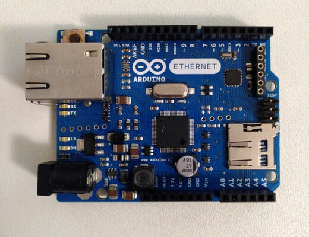
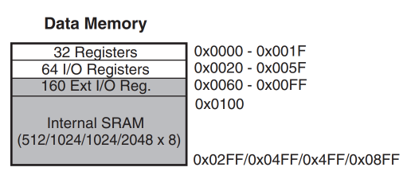

@def title = "Running Julia baremetal on an Arduino"
@def tags = ["julia", "c", "arduino"]

# Running Julia baremetal on an Arduino

\toc

## Preamble

I don't really have much experience with microcontrollers. I've played around with some arduinos before
and the main entry point for my home network is a Raspberry Pi, but that's about it for recent experience.
I did take a single course on microcontrollers a few years back, and I was hilariously bad at it, barely
reaching a passing grade. Nonetheless, I am fascinated by them - they're low powered devices
that we can program to make almost anything happen, as long as we're a little careful with ressource
management and don't shoot ourselves in the foot.

One thing that is always implicitly assumed when talking about julia is the requirement for a runtime and
garbage collector. Most of the time, optimizing julia (or any code, really) comes down to two things:

  1) minimize the time spent running code you didn't write
  2) have as much code you want to run compiled to the native instructions of where you want to run it

Requirement 1) results more or less in "don't talk to runtime & GC if you don't have to" and 2) boils down to
"make sure you don't run unnecessary code, like an interpreter" - i.e. statically compile your code and avoid
dynamicness wherever you can.[^runtimenote]

I'm already used to 1) due to regular optimization when helping people  on Slack and Discourse, and with better static
compilation support inching ever closer over the past few years and me procrastinating writing my bachelors' thesis
last week, I thought to myself

 1. Julia is based on LLVM and is basically already a compiled language.
 2. You've got some old arduinos lying around.
 3. You know those take in some AVR blob to run as their code.
 4. LLVM has an AVR backend.

and the very next thought I had was "that can't be too difficult to get to work, right?".

This is the (unexpectedly short) story of how I got julia code to run on an arduino.

[^runtimenote]: Funnily enough, once you're looking for it, you can find these concepts everywhere. For example, you want to minimize the number of times you talk to the linux kernel on an OS, since context switches are expensive. You also want to call into fast native code as often as possible, as is done in python by calling into C when performance is required.

## <blink> an LED in C

So, what are we dealing with? Well, even arduino don't sell these anymore:

@@left @@

This is an [Arduino Ethernet R3][arduinodoc], a variation on the common Arduino UNO. It's the third revision, boasting an ATmega328p,
an ethernet port, a slot for an SD card as well as 14 I/O pins, most of which are reserved. It has 32KB of flash memory, 2KB SRAM and 1KB EEPROM.
Its clock runs at measly 16 MHz, there's a serial interface for an external programmer and it weighs 28g.

With this documentation, the [schematic][arduinoschema] for the board, the [datasheet][atmegadatasheet] for the microcontroller
and a good amount of "you've done harder things before" I set out to achieve the simplest goal imaginable: Let the LED labeled `L9`
(see the lower left corner of the board in the image above, right above the `on` LED above the  power connector) blink.

For comparison sake and to have a working implementation to check our arduino with, here's a C implementation of what we're trying to do:

```C
#include <avr/io.h>
#include <util/delay.h>

#define MS_DELAY 3000

int main (void) {
    DDRB |= _BV(DDB1);

    while(1) {
        PORTB |= _BV(PORTB1);

        _delay_ms(MS_DELAY);

        PORTB &= ~_BV(PORTB1);

        _delay_ms(MS_DELAY);
    }
}
```

This short piece of code does a few things. It first configures our LED-pin as an output, which we can do by setting pin
`DDB1`[^ddb1pin] in `DDRB` (which is a contraction of "**D**ata **D**irection **R**egister Port **B**" - it controls whether
a given I/O pin is interpreted as input or output). After that, it enters an infinite loop, where we first set our pin
`PORTB1` on `PORTB` to `HIGH` (or `1`) to instruct our controller to power the LED. We then wait for `MS_DELAY` milliseconds,
or 3 seconds. Then, we unpower the LED by setting the same `PORTB1` pin to `LOW` (or `0`). Compiling & flashing this code
like so[^compileflags] :

```sh
avr-gcc -Os -DF_CPU=16000000UL -mmcu=atmega328p -c -o blink_led.o blink_led.c
avr-gcc -mmcu=atmega328p -o blink_led.elf blink_led.o
avr-objcopy -O ihex blink_led.elf blink_led.hex
avrdude -V -c arduino -p ATMEGA328P -P /dev/ttyACM0 -U flash:w:blink_led.hex
```

results in a nice, blinking LED.

These few shell commands compile our `.c` soure code to an `.o` object file targeting our microcontroller, link it into an
`.elf`, translate that to the Intel `.hex` format the controller expects and finally flash it
to the controller with the appropriate settings for `avrdude`. Pretty basic stuff. It shouldn't be hard to translate this,
so where's the catch?

Well, most of the code above is not even C, but C preprocessor directives tailored to do exactly what we mean to do. We can't
make use of them in julia and we can't import those `.h` files, so we'll have to figure out what they mean. I haven't checked,
but I think not even `_delay_ms` is a function.

On top of this, we don't have a convenient existing `avr-gcc` to compile julia to AVR for us. However, if we manage to produce
a `.o` file, we should be able to make the rest of the existing toolchain work for us - after all, `avr-gcc` can't tell the
difference between a julia-created `.o` and a `avr-gcc` created `.o`.

[^ddb1pin]: Finding the right pin & port took a while. The [documentation states](https://docs.arduino.cc/retired/boards/arduino-ethernet-rev3-without-poe#input-and-output) that the LED is connected to "digital pin 9", which is supported by the label `L9` next to the LED itself. It then goes on to say that on most of the arduino boards, this LED is placed on pin 13, which is used for SPI on mine instead. This is confusing, because the datasheet for our board connects this LED to pin 13 (`PB1`, port B bit 1) _on the controller_, which has a split trace leading to pin 9 of the `J5` pinout. I mistakenly thought "pin 9" referred to the microcontroller, and tried to control the LED through `PD5` (port D, bit 5) for quite some time, before I noticed my mistake. The upside was that I now had a known-good piece of code that I could compare to - even on the assembly level.

[^compileflags]: `-DF_CPU=16000000UL` is required for `_delay_ms` to figure out how to translate from milliseconds to "number of cycles required to wait" in our loops. While it's nice to have, it's not really required - we only have to wait _some_ visibly distinct amount to notice the blinking, and as such, I've skipped implementing this in the julia version.

## A first piece of julia pseudocode

So with all that in mind, let's sketch what we think our code should look like:

```julia
const DDRB = ??
const PORTB = ??

function main()
    set_high(DDRB, DDB1) # ??

    while true
        set_high(PORTB, PORTB1) # ??

        for _ in 1:500000
            # busy loop
        end

        set_low(PORTB, PORTB1) # ??

        for _ in 1:500000
            # busy loop
        end
    end
end
```

From a high level, it's almost exactly the same. Set bits, busy loop, unset bits, loop. I've marked all places where we
have to do something, though we don't know exactly what yet, with `??`. All of these places are a bit interconnected,
so let's dive in with the first big question: how can we replicate what the C-macros `DDRB`, `DDB1`, `PORTB` and `PORTB1` end up doing?

### Datasheets & Memory Mapping

To answer this we first have to take a step back, forget that these are defined as macros in C and think back to what
these represent. Both `DDRB` and `PORTB` reference specific I/O registers in our microcontroller. `DDB1` and `PORTB1`
refer to the (zero-based) 1st bit of the respective register. In theory, we only have to set these bits in the registers
above to make the controller blink our little LED. How do you set a bit in a specific register though? This has to be exposed
to a programmer somehow (in assembly code we'd just access the register natively, after all).

When we take a look in our microcontroller datasheet, we can notice that there's a chapter `36. Register Summary` from page 621
onwards. This section is a register reference table. It has an entry for each register, specifying an address, a name, the name
of each bit as well as the page in the datasheet where further documentation, such as initial values, can be found. Scrolling to
the end, we find what we've been looking for:

@@table
| Address     | Name  | Bit 7  | Bit 6  | Bit 5  | Bit 4  | Bit 3  | Bit 2  | Bit 1  | Bit 0  | Page |
|:-----------:|:-----:|:------:|:------:|:------:|:------:|:------:|:------:|:------:|:------:|:----:|
| 0x05 (0x25) | PORTB | PORTB7 | PORTB6 | PORTB5 | PORTB4 | PORTB3 | PORTB2 | PORTB1 | PORTB0 | 100  |
| 0x04 (0x24) | DDRB  | DDR7   | DDR6   | DDR5   | DDR4   | DDR3   | DDR2   | DDR1   | DDR0   | 100  |
@@

So `PORTB` is mapped to address `0x05` and `0x25`, while `DDRB` is mapped to address `0x04` and `0x24`. Which memory are those
addresses referring to? We have EEPROM, flash memory as well as SRAM after all. Once again, the datasheet comes to our help:
Chapter `8 AVR Memories` has a short section on our SRAM memory, with a very interesting figure:

@@imgcenter

@@

as well as this explanation:

> The first 32 locations [of SRAM] address the Register File, the next 64 locations the standard I/O memory, then 160 locations
> of Extended I/O memory, and the next 512/1024/1024/2048 locations address the internal data SRAM.

So the addresses we got from the register summary actually correspond 1:1 to SRAM addresses[^memoryindirection]. Neat!

Translating what we've learned into code, our prototype now looks like this:

```julia:./code/naive_pointers.jl
const DDRB  = Ptr{UInt8}(36) # 0x25, but julia only provides conversion methods for `Int`
const PORTB = Ptr{UInt8}(37) # 0x26

# The bits we're interested in are the same bit as in the datasheet
#                76543210
const DDB1   = 0b00000010
const PORTB1 = 0b00000010

function main_pointers()
    unsafe_store!(DDRB, DDB1)

    while true
        pb = unsafe_load(PORTB)
        unsafe_store!(PORTB, pb | PORTB1) # enable LED

        for _ in 1:500000
            # busy loop
        end

        pb = unsafe_load(PORTB)
        unsafe_store!(PORTB, pb & ~PORTB1) # disable LED

        for _ in 1:500000
            # busy loop
        end
    end
end
```

We can write to our registers by storing some data at its address, as well as read from our register by reading from the same address.

In one fell swoop, we got rid of all of our `??` at once! This code now seemingly has everything the C version has, so let's start on
the biggest unknown: how do we compile this?

[^memoryindirection]: This is in contrast to more high level systems like an OS kernel, which utilizes virtual RAM and paging of sections of memory to give the illusion of being on the "baremetal" machine and handling raw pointers.

## Compiling our code

Julia has for quite some time now run on more than just x86(_64) - it also has support for Linux as well as macOS on ARM. These are,
in large part, possible due to LLVM supporting ARM. However, there is one other large space where julia code can run directly: GPUs.
For a while now, the package [GPUCompiler.jl][gpucompiler] has done a lot of work to compile julia down to `NVPTX` and `AMDGPU`, the
NVidia and AMD specific architectures supported by LLVM. Because GPUCompiler.jl interfaces with LLVM directly, we can hook into this
same mechanism to have it produce AVR instead - the interface is extensible!

### Configuring LLVM

The default julia install does not come with the AVR backend of LLVM enabled, so we have to build both LLVM and julia ourselves. Be
sure to do this on one of the `1.8` betas, like `v1.8.0-beta3`. More recent commits currently break CPUCompiler.jl with this, which
should be fixed in the future as well.

Julia luckily already supports building its dependencies, so we just have to make a few changes to two `Makefile`s, enabling the backend

```patch
diff --git a/deps/llvm.mk b/deps/llvm.mk
index 5afef0b83b..8d5bbd5e08 100644
--- a/deps/llvm.mk
+++ b/deps/llvm.mk
@@ -60,7 +60,7 @@ endif
 LLVM_LIB_FILE := libLLVMCodeGen.a
 
 # Figure out which targets to build
-LLVM_TARGETS := host;NVPTX;AMDGPU;WebAssembly;BPF
+LLVM_TARGETS := host;NVPTX;AMDGPU;WebAssembly;BPF;AVR
 LLVM_EXPERIMENTAL_TARGETS :=
 
 LLVM_CFLAGS :=
```

and instruct julia not to use the prebuilt LLVM by setting a flag in `Make.user`:

```Makefile
USE_BINARYBUILDER_LLVM=0
```

Now, after running `make` to start the build process, LLVM is downloaded, patched & built from source and made available to our julia code.
The whole LLVM compilation took about 40 minutes on my laptop.

### Defining an architecture

With our custom LLVM built, we can define everything that's necessary for GPUCompiler.jl to figure out what we want.

We start by importing our dependencies, defining our target architecture and its [target triplet](https://wiki.osdev.org/Target_Triplet):

```julia:./code/arduino.jl
import Pkg # hide
Pkg.activate(joinpath(@__DIR__, "articles/Running Julia baremetal on an Arduino/code")) # hide
Pkg.add(["GPUCompiler", "LLVM"]) # hide
using GPUCompiler
using LLVM

#####
# Compiler Target
#####

struct Arduino <: GPUCompiler.AbstractCompilerTarget end

GPUCompiler.llvm_triple(::Arduino) = "avr-unknown-unkown"
GPUCompiler.runtime_slug(::GPUCompiler.CompilerJob{Arduino}) = "native_avr-jl_blink"

struct ArduinoParams <: GPUCompiler.AbstractCompilerParams end
```

We're targeting a machine that's running `avr`, with no known vendor and no OS - we're baremetal after all. We're also providing a runtime slug
to identify our binary by. We're also defining a dummy struct to hold additional parameters for our target architecture. We don't require any,
so we can just leave it empty and otherwise ignore it.

Since the julia runtime can't run on GPUs, GPUCompiler.jl also expects us to provide a replacement module for various operations we might want
to do, like allocating memory on our target architecture or throwing exceptions. We're of course not going to do any of that, which is why
we can just define an empty placeholder for these as well:

```julia:./code/runtime.jl
module StaticRuntime
    # the runtime library
    signal_exception() = return
    malloc(sz) = C_NULL
    report_oom(sz) = return
    report_exception(ex) = return
    report_exception_name(ex) = return
    report_exception_frame(idx, func, file, line) = return
end

GPUCompiler.runtime_module(::GPUCompiler.CompilerJob{<:Any,ArduinoParams}) = StaticRuntime
GPUCompiler.runtime_module(::GPUCompiler.CompilerJob{Arduino}) = StaticRuntime
GPUCompiler.runtime_module(::GPUCompiler.CompilerJob{Arduino,ArduinoParams}) = StaticRuntime
```

In the future, these calls may be used to provide a simple bump allocator or report exceptions via the serial bus for other code targeting the
arduino. For now though, this "do nothing" runtime is sufficient.[^remarkruntime]

Now for the compilation. We first define a job for our pipeline:

```julia:./code/native_job.jl
function native_job(@nospecialize(func), @nospecialize(types))
    @info "Creating compiler job for '$func($types)'"
    source = GPUCompiler.FunctionSpec(
                func, # our function
                Base.to_tuple_type(types), # its signature
                false, # whether this is a GPU kernel
                GPUCompiler.safe_name(repr(func))) # the name to use in the asm
    target = Arduino()
    params = ArduinoParams()
    job = GPUCompiler.CompilerJob(target, source, params)
end
```

This then gets passed to our LLVM IR builder:

```julia:./code/build_ir.jl
function build_ir(job, @nospecialize(func), @nospecialize(types))
    @info "Bulding LLVM IR for '$func($types)'"
    mi, _ = GPUCompiler.emit_julia(job)
    ir, ir_meta = GPUCompiler.emit_llvm(
                    job, # our job
                    mi; # the method instance to compile
                    libraries=false, # whether this code uses libraries
                    deferred_codegen=false, # is there runtime codegen?
                    optimize=true, # do we want to optimize the llvm?
                    only_entry=false, # is this an entry point?
                    ctx=JuliaContext()) # the LLVM context to use
    return ir, ir_meta
end
```

We first get a method instance from the julia runtime and ask CPUCompiler to give us the corresponding LLVM IR
for our given job, i.e. for our target architecture. We don't use any libraries and we can't run codegen, but julia specific
optimizations sure would be nice.

After this, it's just emitting of AVR ASM:

```julia:./code/build_obj.jl
function build_obj(@nospecialize(func), @nospecialize(types); kwargs...)
    job = native_job(func, types)
    @info "Compiling AVR ASM for '$func($types)'"
    ir, ir_meta = build_ir(job, func, types)
    obj, _ = GPUCompiler.emit_asm(
                job, # our job
                ir; # the IR we got
                strip=true, # should the binary be stripped of debug info?
                validate=true, # should the LLVM IR be validated?
                format=LLVM.API.LLVMObjectFile) # What format would we like to create?
    return obj
end
```

[^remarkruntime]: The eagle eyed may notice that this is suspiciously similar to what one needs for Rust - something to allocate and something to report errors. This is no coincidence - it's the minimum required for a language that usually has a runtime that handles things like signals and allocation of memory for you. Spinning this further could lead one to think that Rust too is garbage collected, since you never have to call `malloc` and `free` yourself - it's all handled by the runtime & compiler, which inserts calls to these (or another allocator) in the appropriate places.

## Looking at the binary

When calling this like `build_obj(main_pointers, Tuple{})` (we don't pass any arguments to main), we receive a `String` containing binary data - this is our compiled object file:

```julia:./code/build_naive_pointers.jl
using Markdown # hide
obj = build_obj(main_pointers, Tuple{})
println(Markdown.htmlesc(escape_string(obj))) # hide
```

{{out ./code/build_naive_pointers.jl}}

Let's take a look at the disassembly, to confirm that this is what we expect to see:

```julia:./code/disasm.jl
function builddump(fun, args)
    obj = build_obj(fun, args)
    mktemp() do path, io
        write(io, obj)
        flush(io)
        str = read(`avr-objdump -dr $path`, String)
        replace(str, r"Main.FD_SANDBOX_[0-9]+." => "") # hide
    end |> print
end
builddump(main_pointers, Tuple{})
```

{{out avrasm ./code/disasm.jl}}

Well that doesn't look good - where has all our code gone? All that's left is a single `out` followed by a single do-nothing relative jump.
That's almost nothing if we compare to the equivalent C code:

```sh
$ avr-objdump -d blink_led.elf
```

```avrasm
[...]
00000080 <main>:
  80:	21 9a       	sbi	0x04, 1	; 4
  82:	2f ef       	ldi	r18, 0xFF	; 255
  84:	8b e7       	ldi	r24, 0x7B	; 123
  86:	92 e9       	ldi	r25, 0x92	; 146
  88:	21 50       	subi	r18, 0x01	; 1
  8a:	80 40       	sbci	r24, 0x00	; 0
  8c:	90 40       	sbci	r25, 0x00	; 0
  8e:	e1 f7       	brne	.-8      	; 0x88 <main+0x8>
  90:	00 c0       	rjmp	.+0      	; 0x92 <main+0x12>
  92:	00 00       	nop
  94:	29 98       	cbi	0x05, 1	; 5
  96:	2f ef       	ldi	r18, 0xFF	; 255
  98:	8b e7       	ldi	r24, 0x7B	; 123
  9a:	92 e9       	ldi	r25, 0x92	; 146
  9c:	21 50       	subi	r18, 0x01	; 1
  9e:	80 40       	sbci	r24, 0x00	; 0
  a0:	90 40       	sbci	r25, 0x00	; 0
  a2:	e1 f7       	brne	.-8      	; 0x9c <main+0x1c>
  a4:	00 c0       	rjmp	.+0      	; 0xa6 <main+0x26>
  a6:	00 00       	nop
  a8:	ec cf       	rjmp	.-40     	; 0x82 <main+0x2>
[...]
```

This sets the same bit on `0x04` (remember, this was `DDRB`), initializes a loop variable over three words, branches, jumps, sets and clears bits.. Basically everything we'd expect our code to do as well, so what gives?

In order to figure out what's going on, we have to remember that julia, LLVM and gcc are optimizing compilers. If they can deduce that
some piece of code has no visible effect, for example because you're always overwriting previous loop iterations, the compiler is usually
free to just delete the superfluous writes because you can't observe the difference anyway.

Here, two things happened:

 1) The initial `unsafe_load` from our pointer triggered undefined behavior, since the initial value of a given pointer is not defined. LLVM saw that, saw that we actually used the read value and eliminated both read & store due to it being undefined behavior and it being free to pick the value it "read" to be the one we wrote, making the load/store pair superfluous.
 2) The now empty loops serve no purpose, so they got removed as well.

In C, you can solve this problem by using `volatile`. That keyword is a very strict way of telling the compiler "Look, I want every single
read & write from and to this variable to happen. Don't eliminate any and don't shuffle them around". In contrast, julia doesn't have this
concept at all - but we do have atomics. So let's use them to see if they're enough, even though semantically they're a tiny bit
different[^volatileatomics].

### Atomicity

With the atomics, our code now looks like this:

```julia:./code/atomic_pointerset.jl
const DDRB  = Ptr{UInt8}(36) # 0x25, but julia only provides conversion methods for `Int`
const PORTB = Ptr{UInt8}(37) # 0x26

# The bits we're interested in are the same bit as in the datasheet
#                76543210
const DDB1   = 0b00000010
const PORTB1 = 0b00000010

function main_atomic()
    ddrb = unsafe_load(PORTB)
    Core.Intrinsics.atomic_pointerset(DDRB, ddrb | DDB1, :sequentially_consistent)

    while true
        pb = unsafe_load(PORTB)
        Core.Intrinsics.atomic_pointerset(PORTB, pb | PORTB1, :sequentially_consistent) # enable LED

        for _ in 1:500000
            # busy loop
        end

        pb = unsafe_load(PORTB)
        Core.Intrinsics.atomic_pointerset(PORTB, pb & ~PORTB1, :sequentially_consistent) # disable LED

        for _ in 1:500000
            # busy loop
        end
    end
end
builddump(main_atomic, Tuple{}) # hide
```

!!! note
	This is *not* how you'd usually use atomics in julia! I'm using intrinsics in hopes of communicating with LLVM directly, since
	I'm dealing with pointers here. For more high-level code, you'd use [`@atomic`](https://docs.julialang.org/en/v1/base/multi-threading/#Base.@atomic) operations on struct fields.

giving us the following assembly:

{{out avrasm ./code/atomic_pointerset.jl}}

At first glance, it doesn't look too bad. We have a little bit more code and we see some `out` instructions, so are we good? Unfortunately, no.
There is only a single `rjmp`, meaning our nice busy loops got eliminated. I also had to insert those `unsafe_load` to not get a segfault
during compilation.. Further, the atomics seem to have ended up reading some pretty weird addresses - they appear to read/write `0x3f`
(or address `63`) which is mapped to `SREG`, or the status register. Even weirder is what it's doing with the value it read:

```avrasm
8:	0f b6       	in	r0, 0x3f	; 63
a:	f8 94       	cli
...
e:	0f be       	out	0x3f, r0	; 63
```

First, reading `SREG` into `r0`, then clearing the interrupt bit, then writing the value we saved back out. I don't know how it got to this code,
but I do know that it's not what we want. So atomics are not the way to go.

[^volatileatomics]: > "Atomic and volatile in the IR are orthogonal; “volatile” is the C/C++ volatile, which ensures that every volatile load and store happens and is performed in the stated order. A couple examples: if a SequentiallyConsistent store is immediately followed by another SequentiallyConsistent store to the same address, the first store can be erased. This transformation is not allowed for a pair of volatile stores.", [LLVM Documentation - Atomics][llvmatomics]

### Inline LLVM-IR

The other option we still have at our disposal is writing inline LLVM-IR. Julia has great support for such constructs, so let's use them:

```julia:./code/volatile_store.jl
const DDRB  = Ptr{UInt8}(36)
const PORTB = Ptr{UInt8}(37)
const DDB1   = 0b00000010
const PORTB1 = 0b00000010
const PORTB_none = 0b00000000 # We don't need any other pin - set everything low

function volatile_store!(x::Ptr{UInt8}, v::UInt8)
    return Base.llvmcall(
        """
        %ptr = inttoptr i64 %0 to i8*
        store volatile i8 %1, i8* %ptr, align 1
        ret void
        """,
        Cvoid,
        Tuple{Ptr{UInt8},UInt8},
        x,
        v
    )
end

function main_volatile()
    volatile_store!(DDRB, DDB1)

    while true
        volatile_store!(PORTB, PORTB1) # enable LED

        for _ in 1:500000
            # busy loop
        end

        volatile_store!(PORTB, PORTB_none) # disable LED

        for _ in 1:500000
            # busy loop
        end
    end
end
builddump(main_volatile, Tuple{}) # hide
```

with our disassembly looking like:

{{out avrasm ./code/volatile_store.jl}}

Much better! Our `out` instructions save to the correct register. Unsurprisingly, all loops are still eliminated. We could force the variable
from busy looping to exist by writing its value somewhere in SRAM, but that's a little wasteful. Instead, we can go one step deeper with our
nesting and have inline AVR assembly in our inline LLVM-IR:

```julia:./code/keep.jl
function keep(x)
    return Base.llvmcall(
        """
        call void asm sideeffect "", "X,~{memory}"(i16 %0)
        ret void
        """,
        Cvoid,
        Tuple{Int16},
        x
)
end

function main_keep()
    volatile_store!(DDRB, DDB1)

    while true
        volatile_store!(PORTB, PORTB1) # enable LED

        for y in Int16(1):Int16(3000)
            keep(y)
        end

        volatile_store!(PORTB, PORTB_none) # disable LED

        for y in Int16(1):Int16(3000)
            keep(y)
        end
    end
end
builddump(main_keep, Tuple{}) # hide
```

This slightly unorthodox _not even `nop`_ construct pretends to execute an instruction that has some sideeffect, using our input as an argument.
I've changed the loop to run for fewer iterations because it makes the assembly easier to read.

Checking the disassembly we get...

{{out avrasm ./code/keep.jl}}

Huzzah! Pretty much everything we'd expect to see is here:

 * We write to `0x05` with `out`
 * We have some `brne` to busy loop with
 * We add something to some register for our looping

Granted, the binary is not as small as the one we compiled with `-Os` from C, but it should work! The only remaining step is to get rid of all
those `.+0` jump labels, which would prevent us from actually looping. I've also dumping enabled relocation labels
(that's the `R_AVR_7_PCREL` stuff) - these are inserted by the compiler make the code relocatable in an ELF file and used by the linker
during final linking of the assembly. Now that we're probably ready to flash, we can link our code into a binary (thereby resolving those relocation labels) and flash it onto our arduino:

```text
$ avr-ld -o jl_blink.elf jl_blink.o

$ avr-objcopy -O ihex jl_blink.elf jl_blink.hex

$ avrdude -V -c arduino -p ATMEGA328P -P /dev/ttyACM0 -U flash:w:jl_blink.hex
avrdude: AVR device initialized and ready to accept instructions

Reading | ################################################## | 100% 0.00s

avrdude: Device signature = 0x1e950f (probably m328p)
avrdude: NOTE: "flash" memory has been specified, an erase cycle will be performed
         To disable this feature, specify the -D option.
avrdude: erasing chip
avrdude: reading input file "jl_blink.hex"
avrdude: input file jl_blink.hex auto detected as Intel Hex
avrdude: writing flash (168 bytes):

Writing | ################################################## | 100% 0.04s

avrdude: 168 bytes of flash written

avrdude done.  Thank you.
```

and after flashing it to the arduino we get...

## <blink> an LED in Julia

~~~
<p style="display: flex; justify-content: center;">
<video style="max-width: 80%; width: auto; height: auto" controls>
<source src="./blinking_led_h264.mp4" type="video/mp4"/>
Your browser does not support the video tag.
</video>
</p>
~~~

Now *THAT* is what I call two days well spent! The arduino is powered through the serial connector on the right.

I want to thank everyone in the Julialang Slack channel `#static-compilation` for their help during this! Without them, I wouldn't have
thought of the relocation labels in linking and their help was invaluable when figuring out what does and does not work when compiling
julia to a, for this language, exotic architecture.

## Limitations

Would I use this in production? Unlikely. It was finicky to get going and random segmentation faults during the compilation process are
really bothersome. I do however believe that this area will steadily improve - after all, it's already working well on GPUs and FPGAs
(or so I'm told - Julia on an FPGA is apparently some commercial offering from a company). From what I know, this is the first julia code
to run native & baremetal on any Arduino/ATmega based chip, which in and of itself is already exciting. Still, the fact that there is no
such thing as a runtime for this (julia uses libuv for tasks - getting that on an arduino seems challenging) means you're mostly going to
be limited to self-written or vetted code that doesn't rely on too advanced features.

Some niceties I'd like to have are better custom-allocator support, to allow actual proper "heap" allocation. I haven't tried yet,
but I think immutable structs (which are often placed on the stack already, which the ATmega328p does have!) should work out of the box.

I'm looking forward to trying out some i²c and SPI communication, but my gut tells me it won't be much different from writing this in C
(unless we get custom allocator support or I use one of the `malloc` based arrays from [StaticTools.jl](https://github.com/brenhinkeller/StaticTools.jl), that is).

## Links & references

 * [Arduino Ethernet R3 Documentation][arduinodoc]
 * [Arduino Ethernet R3 Schematic][arduinoschema]
 * [ATmega328p Datasheet][atmegadatasheet]
 * [GPUCompiler][gpucompiler]
 * [LLVM Documentation - Atomics][llvmatomics]

[arduinodoc]: https://docs.arduino.cc/retired/boards/arduino-ethernet-rev3-without-poe
[arduinoschema]: https://www.arduino.cc/en/uploads/Main/arduino-ethernet-R3-schematic.pdf
[atmegadatasheet]: https://ww1.microchip.com/downloads/en/DeviceDoc/ATmega48A-PA-88A-PA-168A-PA-328-P-DS-DS40002061B.pdf
[gpucompiler]: https://github.com/JuliaGPU/GPUCompiler.jl
[llvmatomics]: https://www.llvm.org/docs/Atomics.html#id4

